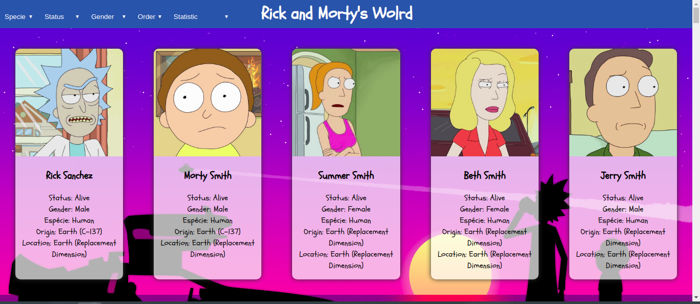
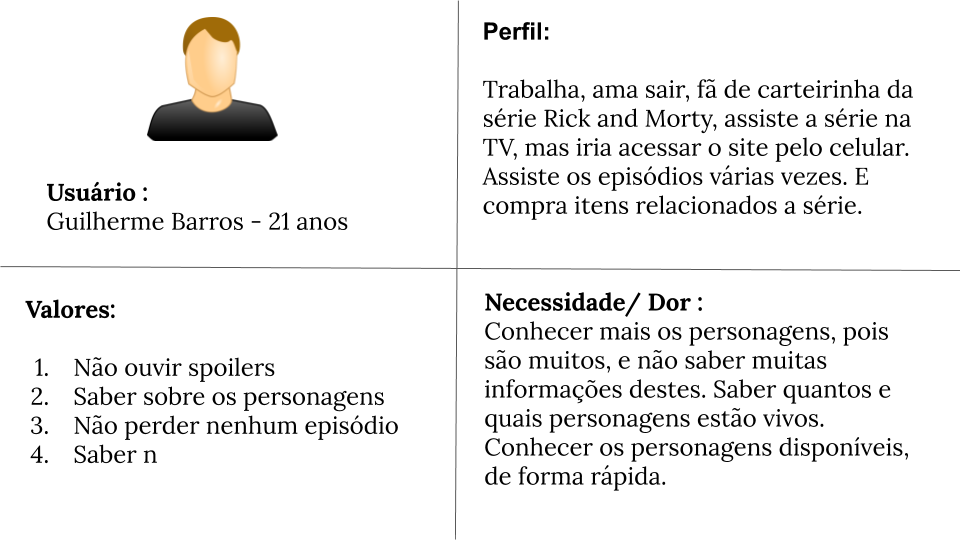
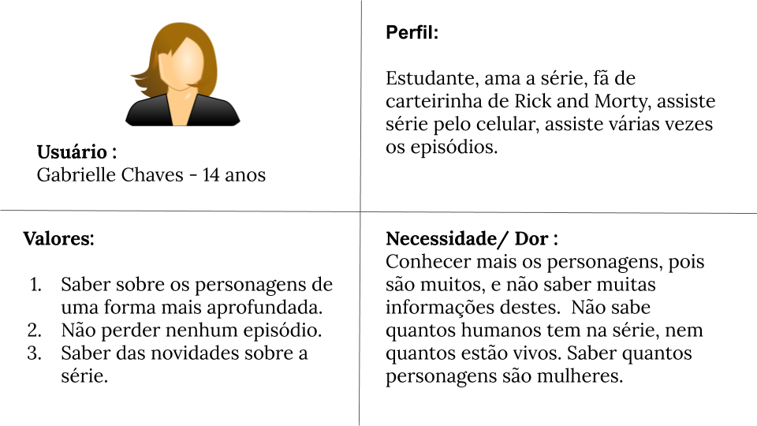

# Data Lovers

## Índice

- [1. Preâmbulo](#1-preâmbulo)
- [2. Resumo do projeto](#2-resumo-do-projeto)
- [3. História do Usuário](#3-história-do-usuário)
- [4. Considerações gerais](#4-consideracoes-gerais)

---

## 1. Preâmbulo

  Segundo a [Forbes](https://www.forbes.com/sites/bernardmarr/2018/05/21/how-much-data-do-we-create-every-day-the-mind-blowing-stats-everyone-should-read), 90% dos dados que existem hoje foram gerados durante os últimos dois anos.
  A cada dia geramos 2.5 milhões de terabytes de dados, uma cifra sem precedentes.

  Apesar disso, os dados por si só são de pouca utilidade. Para que essas grandes
  quantidades de dados se convertam em **informação** compreensível para os
  usuários, precisamos entender e processar estes dados. Uma forma simples de
  fazer isso é criando _interfaces_ e _visualizações_.

  Na imagem seguinte, você pode ser como os dados que estão na parte esquerda
  podem ser usados para construir a interface amigável e compreensível que está
  na parte direita.

  

  \* Você pode ver em detalhe os dados neste [link](https://gist.github.com/lalogf/dd4aa3017a9f8aa8f90dfbca382c4dc9#file-student-json)
  e a interface construída a partir dele neste [link](https://app.talento.laboratoria.la/profile/HFOoMpOreBU2psCcjjLg5O2EWEv2).

## 2. Resumo do projeto

  Neste projeto construimos uma aplicação, onde apresentaremos o mundo de Rick e Morty, utiizando a base de dados [Rick and Morty](src/data/rickandmorty/rickandmorty.json), mostrando atráves de cards os personagem e sua informaçẽos principais, como nome; gênero; status de vida; espécie; origem;última localização.

  

  A aplicação foi baseada em três personas:

  - Primeira persona:

    

  - Segunda persona:
    

  Com o protótipo feito no [Marvel](https://marvelapp.com/1ibhhfe6/screen/61885663)

## 3. História de Usuário

  Os usuários são espectadores de Rick and Morty, fãs, que assistem e reassistem os epsódios.

  Seus desejos são saber mais sobre os personagens, pois os epsódios são muito intensos e em alguas ocasiões é difícil saber o que aconteceu com os personagens, se estão vivos ou mortos, e onde eles foram vistos por último. Relembrar alguns personagens esquecidos, assim como saber de onde eles nasceram. Organizar por espécies, status de vida e gênero.

  Pensando dessa forma, escolhemos mostrar todas as informações dentro do card, para que o usuário consiga visualizar de forma rápida e prática as informações que ele deseja. Assim como filtrar por espécie, status de vida, gênero e gráficos de porcetagem de cada select.

## 4. Considerações gerais

  O projeto foi desenvolvido em três sprints de uma semana cada, onde foi separado em quatros histórias:

  - **Primeira História:**

  Eu como consumidora gostaria de conseguir saber quais são os personagens que são humanos, aliens, desconhecidos, vivo, mortos, desconhecidos, espécie, espécie desconhecido, origem, localizção. Em formatos que consiga selecionar o que eu desejo, mas me mostre as informações de uma forma única e rápida.

  - **Segunda História:**

  Gostaria que o site me mostrasse todos os personagens, pois não gostaria de pesquisar somente por botões, sendo assim, consigo lembrar dos personagens que aperecem na tela, sem o trabalho de pesquisar.

  - **Terceira História:**

  A ordem alfabética me ajuda a procurar por personagens que desejo saber informações, mas começam com letras no final do alfabeto. Tendo está opção facilitará a procura.

  - **Quarta História:**

  Há muitos personagens na série, mas quantos são humanos? Quantos são mulheres? Quantos estão vivos? Seria uma informação interessante para saber. Não tem como saber dessas informações só assistindo a série.

  Foram utilizados HTML 5, JavaScript e CSS 3. Onde as imagens foram apresentados em forma de card, com as informações associada a cada personagem.

